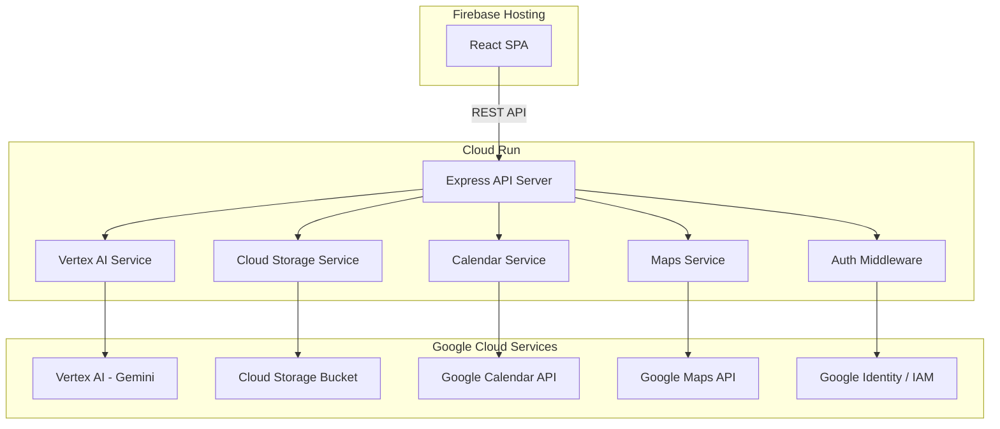

# Design Document: Election Assistant

## Overview

The Election Assistant is a full-stack web application that guides users through election processes using an AI-powered conversational interface. The system uses a React frontend hosted on Firebase Hosting, a Node.js/Express backend on Cloud Run, and integrates Google Vertex AI (Gemini) for natural language understanding. Supporting Google services include Cloud Storage for election data, Google Calendar API for reminders, Google Maps API for polling station lookup, and Google Identity/IAM for authentication.

The architecture follows a clean client-server model with the React SPA communicating exclusively through REST API endpoints. The backend orchestrates calls to Google services and Vertex AI, keeping API keys and credentials server-side.

## Architecture



### Request Flow

1. User interacts with the React chat UI
2. Frontend sends authenticated requests to Express API endpoints
3. Auth middleware validates the user's Google Identity token and determines role
4. Route handler delegates to the appropriate service (AI, Storage, Calendar, Maps)
5. Service calls the corresponding Google Cloud API
6. Response flows back through the handler, formatted for the frontend
7. Frontend renders the response as chat bubbles, cards, or timeline components

## Components and Interfaces

### Frontend Components

| Component | Responsibility |
|---|---|
| `App` | Root component, routing, auth state management |
| `ChatView` | Main chat interface with message history and input |
| `MessageBubble` | Renders a single chat message (user or agent) |
| `FAQCard` | Renders an FAQ question/answer card inline |
| `PollingLocationCard` | Renders polling station info with Maps link |
| `ReminderCard` | Renders a deadline/event with "Set Reminder" action |
| `TimelineView` | Renders election milestones in chronological order |
| `LoginView` | Google Sign-In UI |
| `LoadingIndicator` | Spinner/skeleton shown while awaiting agent response |

### Backend Services

| Service | Responsibility |
|---|---|
| `chatRouter` | POST /api/chat — accepts message + sessionId, returns agent response |
| `timelineRouter` | GET /api/timeline — returns milestones for an election format |
| `pollingRouter` | GET /api/polling-stations — accepts location, returns stations |
| `calendarRouter` | POST /api/calendar/reminder — creates a Calendar event |
| `vertexAIService` | Wraps Vertex AI Gemini calls with prompt construction and response parsing |
| `storageService` | Reads/writes Election_Dataset JSON from/to Cloud Storage |
| `calendarService` | Creates Google Calendar events via the Calendar API |
| `mapsService` | Queries Google Maps Places API for polling stations |
| `authMiddleware` | Validates Google Identity tokens, attaches user role to request |
| `validationMiddleware` | Sanitizes and validates request parameters |

### API Endpoints

```
POST /api/chat
  Body: { message: string, sessionId: string }
  Response: { response: string, cards?: Card[], sessionId: string }

GET /api/timeline?format=local|state|national
  Response: { milestones: Milestone[] }

GET /api/polling-stations?location=string
  Response: { stations: PollingStation[] }

POST /api/calendar/reminder
  Body: { milestone: Milestone }
  Response: { success: boolean, eventDetails?: CalendarEvent }
```


## Data Models

### Frontend Types

```typescript
interface Message {
  id: string;
  role: 'user' | 'agent';
  content: string;
  cards?: Card[];
  timestamp: Date;
}

type Card = FAQCard | PollingLocationCard | ReminderCard;

interface FAQCard {
  type: 'faq';
  question: string;
  answer: string;
}

interface PollingLocationCard {
  type: 'polling-location';
  name: string;
  address: string;
  mapsUrl: string;
}

interface ReminderCard {
  type: 'reminder';
  phaseName: string;
  date: string; // ISO 8601
  description: string;
  calendarEventId?: string;
}

interface Milestone {
  id: string;
  phaseName: string;
  date: string; // ISO 8601
  description: string;
  electionFormat: 'local' | 'state' | 'national';
}

interface Session {
  sessionId: string;
  userId: string;
  history: Message[];
  createdAt: Date;
  lastActiveAt: Date;
}

interface User {
  uid: string;
  email: string;
  role: 'voter' | 'administrator';
}
```

### Backend Types

```typescript
interface ElectionDataset {
  id: string;
  format: 'local' | 'state' | 'national';
  faqs: FAQEntry[];
  milestones: MilestoneEntry[];
  pollingStations: PollingStationEntry[];
  lastUpdated: string; // ISO 8601
}

interface FAQEntry {
  id: string;
  question: string;
  answer: string;
  phase: ElectionPhase;
  tags: string[];
}

interface MilestoneEntry {
  id: string;
  phaseName: string;
  date: string; // ISO 8601
  description: string;
}

interface PollingStationEntry {
  id: string;
  name: string;
  address: string;
  latitude: number;
  longitude: number;
}

type ElectionPhase = 'registration' | 'campaigning' | 'voting' | 'counting' | 'certification';

interface ChatRequest {
  message: string;
  sessionId: string;
}

interface ChatResponse {
  response: string;
  cards?: Card[];
  sessionId: string;
}

interface CalendarReminderRequest {
  milestone: Milestone;
}

interface CalendarReminderResponse {
  success: boolean;
  eventDetails?: {
    eventId: string;
    summary: string;
    startDate: string;
    htmlLink: string;
  };
}

interface APIError {
  statusCode: number;
  message: string;
  details?: string;
}
```

### Data Serialization

Election datasets are stored as JSON files in Google Cloud Storage. The `storageService` handles serialization and deserialization:

- **Serialize**: `ElectionDataset` → JSON string → Cloud Storage object
- **Deserialize**: Cloud Storage object → JSON string → `ElectionDataset`
- **Round-trip guarantee**: `deserialize(serialize(dataset))` produces an equivalent `ElectionDataset` object


## Correctness Properties

*A property is a characteristic or behavior that should hold true across all valid executions of a system — essentially, a formal statement about what the system should do. Properties serve as the bridge between human-readable specifications and machine-verifiable correctness guarantees.*

### Property 1: Session history included in prompt

*For any* session with N messages, the prompt constructed for Vertex AI should include all N messages from the session history, preserving their order and content.

**Validates: Requirements 1.4**

### Property 2: ElectionDataset serialization round-trip

*For any* valid ElectionDataset object, serializing it to JSON and then deserializing the JSON back should produce an object equivalent to the original.

**Validates: Requirements 2.4, 2.5**

### Property 3: Milestones chronological ordering

*For any* list of milestones, the timeline sorting function should produce a list where each milestone's date is less than or equal to the next milestone's date.

**Validates: Requirements 3.1**

### Property 4: Calendar event request correctness

*For any* milestone, the Google Calendar event request constructed from that milestone should contain the milestone's date as the event start date and the milestone's description in the event summary.

**Validates: Requirements 3.2**

### Property 5: Milestone rendering completeness

*For any* milestone object, the rendered TimelineView output should contain the milestone's phase name, date, and description.

**Validates: Requirements 3.5**

### Property 6: PollingLocationCard rendering completeness

*For any* polling station data, the rendered PollingLocationCard should contain the station name, address, and a Google Maps directions URL.

**Validates: Requirements 4.3**

### Property 7: Role-based access control

*For any* user with a role and any API endpoint, the authorization middleware should grant access if and only if the user's role is authorized for that endpoint. Voters should be restricted to public endpoints; administrators should have access to all endpoints.

**Validates: Requirements 5.2, 5.3, 5.4**

### Property 8: Card type rendering

*For any* agent response containing cards, the rendered conversation should include the correct React component for each card type: FAQCard for FAQ data, PollingLocationCard for polling data, and ReminderCard for reminder data.

**Validates: Requirements 6.3, 6.4, 6.5, 6.6**

### Property 9: ARIA attributes on interactive components

*For any* interactive UI component rendered by the Election Assistant, the component should have appropriate ARIA labels and roles in its DOM output.

**Validates: Requirements 7.2**

### Property 10: Invalid request rejection

*For any* API endpoint and any request body missing required fields or containing invalid types, the endpoint should return a 400 status code with a descriptive error message.

**Validates: Requirements 8.5**

### Property 11: Input sanitization

*For any* request parameter containing potentially dangerous content (HTML tags, script injections), the sanitization function should produce output that does not contain executable script content or unescaped HTML.

**Validates: Requirements 8.7**

## Error Handling

### Backend Error Strategy

| Error Type | HTTP Status | Behavior |
|---|---|---|
| Invalid request parameters | 400 | Return descriptive error message with field-level details |
| Authentication failure | 401 | Return login prompt message |
| Authorization failure | 403 | Return access denied message |
| Cloud Storage file missing/corrupted | 500 | Log error, return fallback default response |
| Vertex AI timeout/failure | 500 | Log error, return generic "service unavailable" message |
| Google Calendar API failure | 502 | Return error suggesting user manually note the date |
| Google Maps API failure | 502 | Return error indicating service temporarily unavailable |
| Unexpected server error | 500 | Log full error details server-side, return generic error to client |

### Frontend Error Strategy

- Network errors: Display a retry prompt with a user-friendly message
- Auth token expiry: Redirect to login with a session-expired message
- Empty polling station results: Display suggestion to broaden search area
- API 4xx errors: Display the error message from the API response
- API 5xx errors: Display a generic "something went wrong" message with retry option

### Error Response Format

```typescript
interface ErrorResponse {
  error: {
    code: number;
    message: string;
  };
}
```

All error responses follow this consistent format. Internal error details (stack traces, service-specific errors) are logged server-side only and never exposed to the client.

## Testing Strategy

### Testing Framework

- **Unit & Integration Tests**: Jest + React Testing Library (frontend), Jest (backend)
- **Property-Based Tests**: fast-check library for JavaScript/TypeScript
- **Coverage Target**: Minimum 80% across frontend and backend

### Unit Tests

Unit tests cover specific examples, edge cases, and error conditions:

- **Frontend**: Component rendering, user interactions, loading states, error states
- **Backend**: Service functions with mocked Google API clients, request validation, error handling
- **Edge cases**: Empty datasets, missing fields, expired tokens, API timeouts

### Property-Based Tests

Each correctness property maps to a single property-based test using fast-check. Each test runs a minimum of 100 iterations.

| Property | Test Description | Tag |
|---|---|---|
| P1 | Generate random session histories, verify prompt includes all messages | Feature: election-assistant, Property 1: Session history included in prompt |
| P2 | Generate random ElectionDataset objects, verify serialize/deserialize round-trip | Feature: election-assistant, Property 2: ElectionDataset serialization round-trip |
| P3 | Generate random milestone lists, verify sort produces chronological order | Feature: election-assistant, Property 3: Milestones chronological ordering |
| P4 | Generate random milestones, verify calendar request contains correct date and description | Feature: election-assistant, Property 4: Calendar event request correctness |
| P5 | Generate random milestones, verify rendered output contains phase name, date, description | Feature: election-assistant, Property 5: Milestone rendering completeness |
| P6 | Generate random polling stations, verify rendered card contains name, address, maps URL | Feature: election-assistant, Property 6: PollingLocationCard rendering completeness |
| P7 | Generate random user/role/endpoint combinations, verify access matches authorization rules | Feature: election-assistant, Property 7: Role-based access control |
| P8 | Generate random agent responses with mixed card types, verify correct components rendered | Feature: election-assistant, Property 8: Card type rendering |
| P9 | Render each interactive component, verify ARIA attributes present | Feature: election-assistant, Property 9: ARIA attributes on interactive components |
| P10 | Generate random invalid request bodies, verify 400 response | Feature: election-assistant, Property 10: Invalid request rejection |
| P11 | Generate random strings with XSS/injection payloads, verify sanitization removes dangerous content | Feature: election-assistant, Property 11: Input sanitization |

### Integration Tests

- API endpoint request-response flows with mocked Google services
- Authentication flow with mocked Google Identity
- End-to-end chat flow: user message → API → mocked Vertex AI → response rendering

### Test Organization

```
client/
  src/
    components/
      __tests__/          # Component unit tests
    services/
      __tests__/          # Frontend service tests
server/
  src/
    services/
      __tests__/          # Backend service unit tests
    routes/
      __tests__/          # API integration tests
    middleware/
      __tests__/          # Auth/validation middleware tests
    __tests__/
      properties/         # Property-based tests
```
