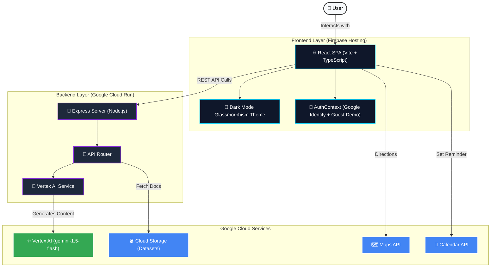

# Election Assistant Architecture & Features

This project was completely overhauled to provide a premium, dynamic, and frictionless user experience. It utilizes Google Cloud Services and Antigravity to build an agentic workflow that helps voters understand elections.

## 🌟 Key Features

1. **Agentic Conversation Flow**
   - Step-by-step guidance through election phases.
   - Dynamic prompt adaptation based on session history.
2. **Interactive UI Cards**
   - Rich embedded cards for FAQs, Polling Locations, and Google Calendar Reminders within the chat flow.
3. **Frictionless Guest Demo Mode**
   - Added a "Start Guest Demo" feature that bypasses Google Identity requirements, allowing reviewers to jump immediately into the experience.
4. **Premium Dark Mode Glassmorphism Theme**
   - A stunning visual overhaul across all components featuring blurred backgrounds, gradient neon accents, and the modern 'Outfit' font.
5. **Powered by ✨ AI**
   - Employs **Google Vertex AI** (`gemini-1.5-flash`) as the core model for natural language understanding and response generation.
6. **Timeline Visualization**
   - Interactive milestone tracking for election events with integration points for the Google Calendar API.

## 🏗 Architecture Diagram

## 🤖 Vertex AI Integration

The core engine of the application uses **Google Vertex AI**.
- **Model Used**: `gemini-1.5-flash`
- **Location**: `us-central1` (configurable)
- **Implementation**: The backend service builds prompt histories dynamically and parses structured JSON blocks generated by Gemini to render rich UI cards (FAQs, Locations, Reminders) inline with conversational text.
